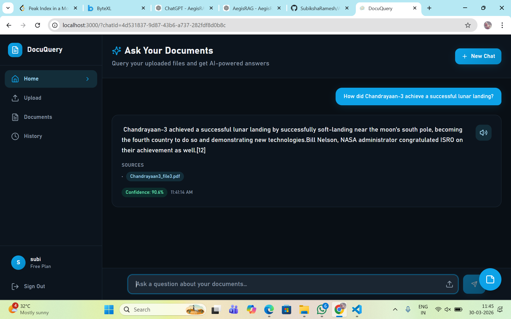
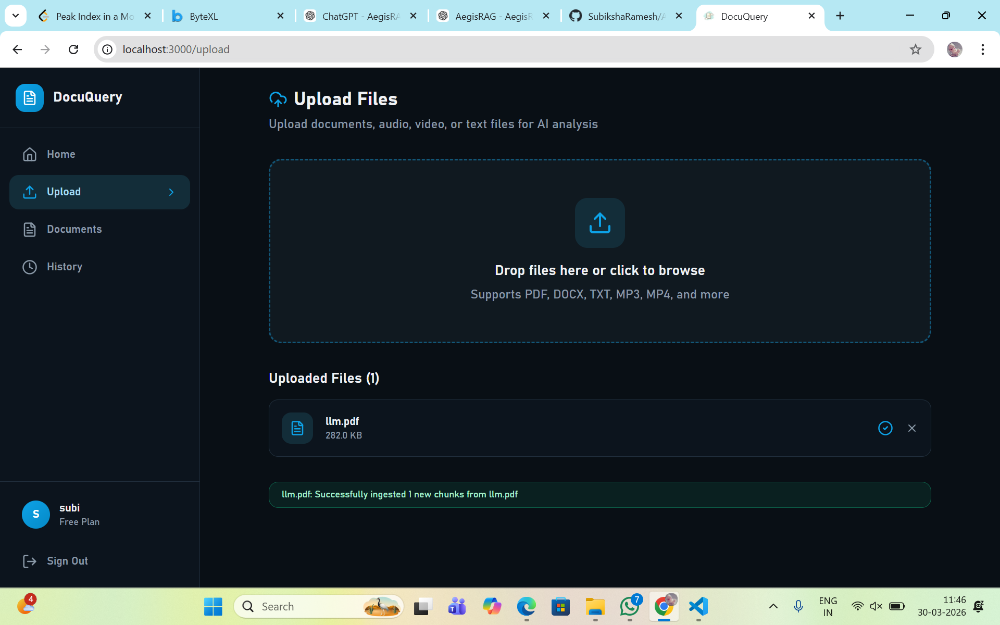
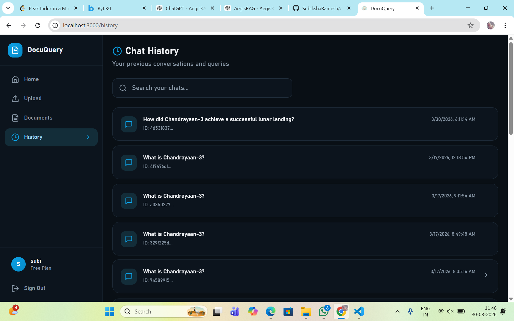
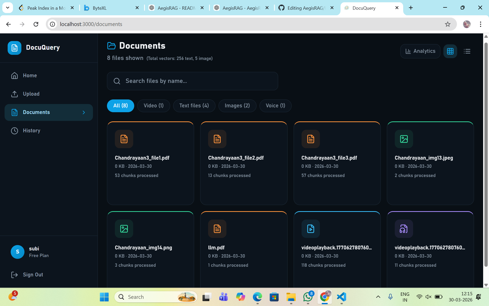

# 🛡️ AegisRAG

### Local-First Multimodal Retrieval-Augmented Generation System

AegisRAG is a **local-first multimodal RAG system** that ingests documents and media, builds hybrid retrieval indexes, and generates grounded, citation-backed answers through a FastAPI backend and React frontend.

It supports knowledge retrieval across **PDF, DOCX, images, audio, and video** while combining semantic retrieval, lexical retrieval, reranking, confidence scoring, and LLM-based answer generation.

---

## 📌 Overview

AegisRAG is designed for secure and local-first knowledge retrieval across heterogeneous data sources.

The system allows users to:

- Upload and process documents and media
- Extract text from multiple modalities
- Generate embeddings for text and images
- Perform semantic and lexical retrieval
- Combine retrieval results using Reciprocal Rank Fusion (RRF)
- Rerank retrieved candidates using a cross-encoder
- Generate grounded answers using an LLM
- Display source citations and confidence scores
- Stream generated responses in real time
- Maintain chat history and document information

> **Local-first:** AegisRAG supports local LLM inference using GGUF models through `llama-cpp-python`. A Groq-based generation path is also supported in the current implementation. A fully verified air-gapped deployment has not been tested, so the system is described as local-first rather than fully offline.

---

# ✨ Key Features

### 📄 Multimodal Ingestion

Supports:

- PDF
- DOCX
- Images
- Audio
- Video

### 🧠 Hybrid Retrieval

Combines multiple retrieval strategies:

- **FAISS** — dense vector retrieval
- **BM25** — lexical/keyword retrieval
- **CLIP** — optional image retrieval

### 🔁 Reciprocal Rank Fusion

Combines rankings from multiple retrieval systems using **RRF**.

### 🎯 Cross-Encoder Reranking

Uses a cross-encoder to improve the relevance ordering of retrieved candidates.

### 📌 Citation-Backed Answers

Answers include source information such as:

- Filename
- Page number when available
- Retrieved snippet
- Relevance score

### 📊 Confidence Scoring

The system calculates a confidence score for the retrieved evidence and can return a fallback response when confidence is low.

### ⚡ Streaming Responses

Supports Server-Sent Events (SSE) for progressively displaying generated responses.

### 🗂️ Chat History

Supports:

- Creating a new conversation
- Storing chat history
- Loading previous conversations
- Maintaining query sessions

### 🖥️ Web Interface

React + TypeScript frontend integrated with the FastAPI backend.

---

# 🧠 System Architecture

```text
                         USER
                           │
                           ▼
                  React Frontend
                           │
                           │ HTTP / SSE
                           ▼
                    FastAPI Backend
                           │
                    ┌──────┴──────┐
                    │             │
                    ▼             ▼
                Ingestion       Query
                    │             │
                    │             ▼
                    │        Query System
                    │             │
                    │     ┌───────┴────────┐
                    │     ▼                ▼
                    │   FAISS             BM25
                    │   Dense            Lexical
                    │ Retrieval         Retrieval
                    │     │                │
                    │     └───────┬────────┘
                    │             ▼
                    │            RRF
                    │             │
                    │             ▼
                    │      Cross-Encoder
                    │        Reranker
                    │             │
                    │             ▼
                    │      Context Construction
                    │             │
                    │             ▼
                    │      Confidence Scoring
                    │             │
                    │             ▼
                    │            LLM
                    │             │
                    │             ▼
                    │    Answer + Sources
                    │
                    ▼
              Processing Pipeline
                    │
          ┌─────────┼─────────┐
          ▼         ▼         ▼
       Text       Image      Audio/Video
          │         │         │
          ▼         ▼         ▼
      Chunking    OCR/CLIP  Whisper/FFmpeg
          │         │         │
          └─────────┴─────────┘
                    │
                    ▼
             Embedding Generation
                    │
             ┌──────┴──────┐
             ▼             ▼
           FAISS         SQLite
          Vectors      Metadata/History
````

---

# 🔄 Data Ingestion Pipeline

```text
Upload File
    │
    ▼
Detect File Type
    │
    ├── PDF
    │     ↓
    │   PDF Text Extraction
    │
    ├── DOCX
    │     ↓
    │   DOCX Text Extraction
    │
    ├── Image
    │     ↓
    │   OCR + Optional CLIP
    │
    ├── Audio
    │     ↓
    │   Whisper Transcription
    │
    └── Video
          ↓
        Audio Extraction
          +
        Frame Sampling
          ↓
        Whisper / Visual Processing

    ↓
Content Extraction
    ↓
Chunking
    ↓
Embedding Generation
    ↓
┌───────────────┬────────────────┐
▼               ▼
FAISS          SQLite
Vectors        Metadata
```

---

# 📦 Supported Data Types

## PDF

PDF documents are processed to extract textual content, which is divided into chunks before embedding.

## DOCX

DOCX documents are processed using document structure such as headings and sections to preserve meaningful context.

## Images

Images can be processed using:

* Tesseract OCR for textual content
* CLIP for optional visual embeddings/retrieval

## Audio

Audio is transcribed using Whisper and the resulting transcript is used for retrieval.

## Video

Video processing can include:

* Audio extraction
* Whisper transcription
* Frame sampling
* Visual processing

---

# ✂️ Chunking Strategy

Chunking converts extracted content into smaller retrieval units.

The configured PDF strategy uses:

* **Chunk size:** 200 words
* **Overlap:** 40 words
* **Minimum chunk size:** 50 words

The overlap helps preserve contextual information across chunk boundaries.

Different modalities use different processing strategies rather than forcing all data into a single chunking method.

---

# 🧠 Embedding Generation

## Text Embeddings

Text chunks are converted into semantic embeddings using **Sentence Transformers**.

The configured text embedding model is:

```text
paraphrase-multilingual-MiniLM-L12-v2
```

Text embeddings are stored/indexed in FAISS.

```text
Text Chunk
    ↓
Sentence Transformer
    ↓
384-dimensional embedding
    ↓
FAISS
```

## Image Embeddings

Image content can be represented using **CLIP** embeddings.

```text
Image
  ↓
CLIP
  ↓
512-dimensional embedding
  ↓
FAISS
```

---

# 🔍 Retrieval Pipeline

When a user submits a query:

```text
User Query
    ↓
Sentence Transformer
    ↓
Query Embedding
    │
    ├─────────────────┐
    ▼                 ▼
  FAISS              BM25
 Dense Retrieval   Lexical Retrieval
    │                 │
    └────────┬────────┘
             ▼
            RRF
             │
             ▼
     Candidate Ranking
             │
             ▼
    Cross-Encoder Reranker
             │
             ▼
     Final Relevant Chunks
             │
             ▼
       Context Construction
```

---

# 🔎 Dense Retrieval — FAISS

FAISS is used for similarity search over embedding vectors.

The system uses vector indexes for:

* Text embeddings
* Image embeddings when applicable

The query is converted into an embedding and compared with indexed vectors to retrieve semantically similar content.

Conceptually:

```text
Document Chunk
      ↓
Embedding
      ↓
FAISS Index


User Query
      ↓
Embedding
      ↓
FAISS Search
      ↓
Nearest Vectors
      ↓
Chunk IDs
```

---

# 🔤 Lexical Retrieval — BM25

BM25 provides keyword-based retrieval.

It is useful when exact terminology, identifiers, technical terms, or specific phrases are important.

Example:

```text
Query:
"t3.micro EC2"

BM25
  ↓
Find chunks containing:
"t3.micro"
"EC2"
```

BM25 complements semantic retrieval from FAISS.

---

# 🔁 Reciprocal Rank Fusion — RRF

FAISS and BM25 can return different rankings.

RRF combines these rankings into a unified ranking.

The RRF formula is:

```text
RRF(d) = Σ 1 / (k + rank(d))
```

The configured value is:

```text
k = 60
```

A higher-ranked result receives a larger contribution to the fused ranking.

```text
FAISS Results
      +
BM25 Results
      ↓
     RRF
      ↓
Combined Ranking
```

---

# 🎯 Cross-Encoder Reranking

After hybrid retrieval, candidate chunks are reranked using a cross-encoder.

The reranker evaluates the query and candidate chunk together:

```text
Query + Candidate Chunk
          ↓
   Cross-Encoder
          ↓
   Relevance Score
```

This allows the system to perform a more detailed relevance evaluation after the initial fast retrieval stage.

The reranking stage helps select the most relevant evidence before constructing the final context.

---

# 🧩 Context Construction

The highest-ranked chunks are combined into the context supplied to the LLM.

```text
User Question
      +
Retrieved Chunks
      ↓
Context Construction
      ↓
Prompt
```

The retrieved metadata is retained so that source information can be returned with the answer.

---

# 📊 Confidence Scoring

AegisRAG calculates a confidence score based on the retrieved evidence and query/retrieval characteristics.

The confidence score is used to help determine whether the system has sufficient evidence to answer.

```text
Retrieved Evidence
        ↓
Confidence Scoring
        │
   ┌────┴────┐
   ▼         ▼
High       Low
   │         │
   ▼         ▼
  LLM      Fallback
Answer     Response
```

This helps reduce unsupported responses when retrieval quality is low.

---

# 🤖 LLM Generation

AegisRAG supports local LLM inference using GGUF models through:

```text
llama-cpp-python
```

The system can also use the Groq-based generation path in the current implementation.

The generation stage receives:

```text
Question
   +
Retrieved Context
   ↓
LLM
   ↓
Grounded Answer
```

The LLM is responsible for generating the final natural-language response from the retrieved evidence.

---

# 📌 Citations

Retrieved source metadata is preserved throughout the retrieval pipeline.

The response can include:

```text
Answer
  +
Sources
  ├── Filename
  ├── Page number
  ├── Snippet
  └── Score
```

This makes it possible for users to trace an answer back to the retrieved evidence.

---

# ⚡ Streaming Responses

AegisRAG supports Server-Sent Events (SSE) through:

```text
POST /api/stream-query
```

Instead of waiting for the complete answer, the frontend can receive generated content progressively.

```text
User Query
    ↓
FastAPI
    ↓
RAG Pipeline
    ↓
LLM
    ↓
SSE Stream
    ↓
React Frontend
    ↓
Progressive Answer
```

---

# 🗂️ Chat History

The application supports persistent chat sessions.

Available functionality includes:

* Creating a new conversation
* Saving messages
* Loading conversation history
* Retrieving individual chat sessions

Chat history is stored in SQLite.

---

# 🗄️ Data & Storage

## SQLite

SQLite is used for structured application data such as:

* Chunk metadata
* Source information
* Chat history
* File-related metadata

## FAISS

FAISS is used for vector indexing and similarity search.

```text
Text vectors  → FAISS
Image vectors → FAISS
```

## Local File Storage

Uploaded files are stored locally for processing and retrieval.

---

# 🌐 API Endpoints

Base path:

```text
/api
```

## Health & Status

```text
GET /api/health
GET /api/status
GET /api/info
```

## Chat

```text
POST /api/chat/new
GET  /api/history
GET  /api/history/{chat_id}
```

## Query

```text
POST /api/query
POST /api/stream-query
```

## Data

```text
POST /api/upload
POST /api/ingest

GET /api/files
GET /api/files/search
GET /api/files/{file_path}
```

---

# 🖥️ Frontend

The frontend is built using:

* React
* TypeScript

It provides:

* Chat interface
* Streaming responses
* Source citations
* Confidence scores
* Chat history
* File upload
* Document explorer

Frontend communication with the backend is handled through the FastAPI API endpoints.

---

# ⚙️ Tech Stack

## 🐍 Programming

* Python
* TypeScript

## 🧠 AI / ML

* Sentence Transformers
* OpenCLIP / CLIP
* LLaMA / Mistral GGUF
* llama-cpp-python
* Whisper

## 🔍 Retrieval

* FAISS
* BM25
* Reciprocal Rank Fusion (RRF)
* Cross-Encoder Reranking

## 📄 Processing

* pdfplumber
* pytesseract
* FFmpeg

## 🚀 Backend

* FastAPI
* Uvicorn

## 🖥️ Frontend

* React
* TypeScript

## 🗄️ Storage

* SQLite
* Local file storage

## 🐳 DevOps

* Docker
* Docker Compose

---

# 🏗️ Project Structure

```text
AegisRAG/
│
├── api/
│   └── API and backend routes
│
├── config/
│   └── Configuration
│
├── core/
│   └── RAG and processing components
│
├── frontend/
│   └── React frontend
│
├── images/
│   └── Project screenshots
│
├── tests/
│   └── Test files
│
├── ui/
│   └── UI components
│
├── Dockerfile
├── docker-compose.yml
├── requirements.txt
├── main.py
├── run.py
├── reingest_all.py
└── README.md
```

---

# 🖼️ Project Preview

## 💬 Chat Interface

The chat interface allows users to ask questions and receive grounded answers with citations and confidence scores.



---

## 📤 Upload & Ingestion

Users can upload supported documents and media for processing and indexing.



---

## 🕘 Chat History

Users can view and reload previous conversations.



---

## 📄 Document Explorer

Users can browse and manage ingested documents.



---

# 🧪 Testing & Verification

Testing has been performed for:

* Document ingestion
* Query processing
* Hybrid retrieval
* RRF ranking
* Reranking
* Streaming responses
* Chat history
* Frontend-backend integration
* Citation generation
* Confidence scoring

A comprehensive automated regression test suite can be expanded as the project evolves.

---

# 🐳 Docker

The project includes Docker configuration for local deployment.

### Run with Docker Compose

```bash
docker-compose up --build
```

The backend exposes:

```text
http://localhost:8000
```

Health check:

```text
/api/health
```

Before deployment, verify that the Docker runtime has access to all required model files and dependencies.

---

# ⚡ Quickstart

## 1. Clone the repository

```bash
git clone https://github.com/SubikshaRamesh/AegisRAG.git
cd AegisRAG
```

## 2. Install backend dependencies

```bash
pip install -r requirements.txt
```

## 3. Start the backend

```bash
python run.py
```

The API will be available at:

```text
http://localhost:8000
```

FastAPI documentation:

```text
http://localhost:8000/docs
```

---

# 🔐 Security & Privacy

AegisRAG is designed with a local-first approach.

When configured for local LLM inference:

* Documents remain on the local system
* Retrieval can be performed locally
* Local GGUF models can be used for generation

However, if the Groq generation path is configured, query/context data is sent to the external API service.

A fully air-gapped deployment has not been verified.

---

# 🔮 Future Development

Planned improvements include:

* 🎥 Frame-level video retrieval
* 🧠 Improved multimodal alignment
* ⚡ Advanced FAISS indexing such as IVF/HNSW
* 📊 Query analytics dashboard
* 👥 Authentication and RBAC
* 🔐 Data encryption
* 📱 Enhanced frontend UX
* ⚙️ Distributed retrieval
* 🏢 Enterprise/on-premise deployment
* ☁️ AWS deployment
* 🐳 Complete Docker runtime validation

---

# 👩‍💻 Author

## Subiksha R

AI Developer | Retrieval-Augmented Generation (RAG) | Multimodal AI Systems

GitHub: [https://github.com/SubikshaRamesh](https://github.com/SubikshaRamesh)

---

# 📄 License

This project is licensed under the **MIT License**.

